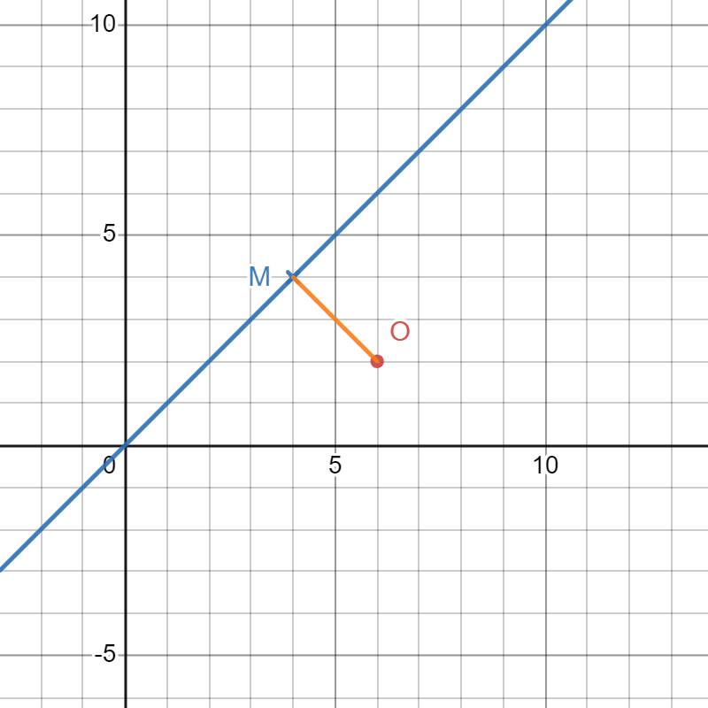
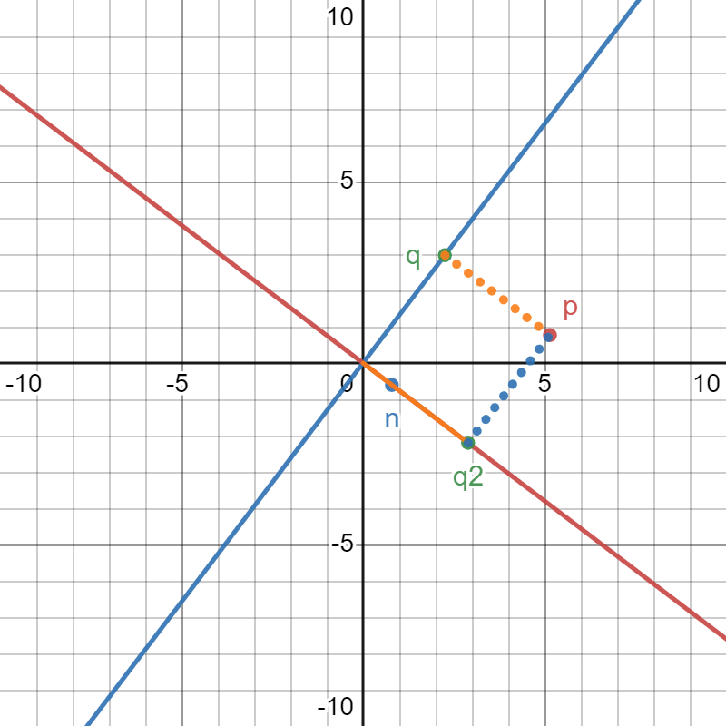
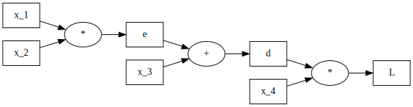
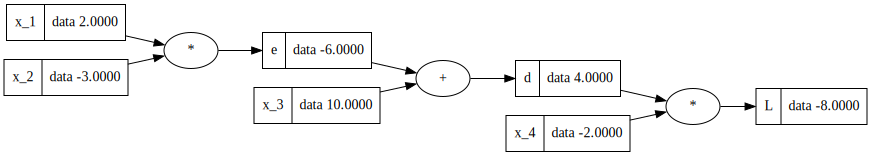
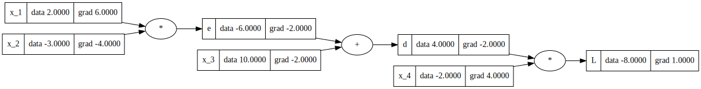

DON'T READ THIS DOC ON GITHUB, INSTEAD USE VS CODE, MARKDOWN LATEX ON GITHUB IS BROKEN

A continuous function can be represented as a vector of arbitrary high dimension.
For example, let's take two arbitrary functions `f` and `g` in vector notation.

$$f = \begin{bmatrix}
..\\
0\\
1\\
4\\
16\\\
..
\end{bmatrix}$$

$$g= \begin{bmatrix}
..\\
2\\
3\\
1\\
6\\
..
\end{bmatrix}$$

It turns out that it simplifies the definition of the following integral by reducting it to a simple dot product.
$$\int f(x) * g(x) \,dx = f . g$$

This is also equal to `f` represented as a one row matrix multiplied by `g`.

$$\begin{bmatrix}
..& 0 & 1 & 4 & 16 & ..
\end{bmatrix}

\begin{bmatrix}
..\\
2\\
3\\
1\\
6\\
..
\end{bmatrix} =
\begin{bmatrix}
f.g
\end{bmatrix}
$$


Now, imagine that `f` get translated by a parameter `t` along `g`.
In a vector representation, you could extend the row matrix `f` by additional rows, each rows representing `f` being shifted by some amount.

$$\begin{bmatrix}
..\\
..& 0 & 1 & 4 & 16 & ..\\
..& 1 & 4 & 16 & 33 & ..\\
..& 4 & 16 & 33 & 57 & ..\\
..
\end{bmatrix}
\begin{bmatrix}
..\\
2\\
3\\
1\\
6\\
..
\end{bmatrix}=
\begin{bmatrix}
..\\
f.g\\
32\\
2\\
-24\\
..
\end{bmatrix}$$

The resulting vector is the vector representation of the correlation of `f` and `g`.

The interesting point is that the resulting vector can be interpreted as a measure of similarity between the two functions for each translation of `f`.
Each scalar in the resulting vector represent the `cross-correlation` of `g` with some shifted version of `f`.

This is because each value in the resulting vector is a dot product between `g` and the translated version of `f`.


$$ f.g = |f| * |g| * cos(fg)$$
Since `|f| * |g|` is constant for all the versions of translated `f`, the only thing changing is the `cos(fg)` varying from -1 to 1.

So the highest the value is, the more the translated version of `f` looks like `g`.

## Fourrier transform

Fundamentally, it is quite similar to the cross correlation case.

If we wanted to see how much different sinusoidale function match a signal `s`, then we could compute the cross correlation.

$$f_f(\tau)= \int s(t) * cos(2 \pi f (t + \tau )) \,dt$$

The maximum value $v_{max}$ of the cross correlation at a given delay a value $\tau_{max}$, would give you respectively how much the frequency $f_f$ is present, and by how much should the sinusoidale be shifted.

The problem with this solution is that we need for each frequency to shift the sinusoidale and calculate the integral for each shift.

There is a more elegant solution.
Imagine a pure signal of frequency `1` shifted by $\tau$.
$$s_{\tau}(t) = cos(2 \pi (t+\tau))$$
Notice how our ideal definition of similarity would be that for any $\tau$, the similarity is the same: It is not because our signal get shifted, that the frequency magnitude should be impacted.

The trick is to calculate both the unshifted correlation with `sin` and `cos` for each frequency.

$$f_{sin}(f)= \int s_{\tau}(t) * sin(2 \pi ft) \,dt$$
$$f_{cos}(f)= \int s_{\tau}(t) * cos(2 \pi f) \,dt$$

Then you calculate $$corr(f)=\sqrt{f_{sin}(f)^2 + f_{cos}(f)^2}$$

This stays the same for all shifted signals $s_{\tau}(t)$!

Notice how all of this can be rewritten in the following, simpler formula
$$f(f)= f_{cos}(f) + i*f_{sin}(f)= $$
$$f(f)= \int s_{\tau}(t)  * cos(2 \pi f)  \,dt + i\int s_{\tau}(t)  * sin(2 \pi f)  \,dt $$
$$f(f)= \int s_{\tau}(t)  * cos(2 \pi f) + i* sin(2 \pi f) \,dt $$
$$f(f)= \int s_{\tau}(t)  * e^{-2 \pi fi} \,dt $$

And the correlation is then nothing more than the magnitude of the imaginary number of each frequency! While the phase is how much we should shift the wave to fit the signal.

## Convolutions

It is often noted `(f * g)(x)`, and can be also seen as `f(x) * g(x)` (in this context `*` isn't a multiplication, and this is different from `f(x)g(x)`)

Convolutions can be seen in different way:

### As a flipped correlation
First, it can be seen as a correlation of `f` and `g` with `g` or `f` flipped, so all our observation for correlation held before applies.
### As a multiplication table

Another way to visualize it is also via a 2 by 2 table, where each row represent a value of `f` and each column a value of `g`, each cell represent the multiplication of the row value `f` by column value `g`. And then all the diagnonal get summed together.

For example, imagine two vectors

$$
a=\begin{bmatrix}
2\\
3\\
1\\
6
\end{bmatrix}

b=\begin{bmatrix}
9\\
2\\
1\\
3
\end{bmatrix}
$$

Then such 2*2 table would be
$$
\begin{bmatrix}
2*9 && 3*9 && 1*9 && 6*9 \\
2*2 && 3*2 && 1*2 && 6*2 \\
2*1 && 3*1 && 1*1 && 6*1 \\
2*3 && 3*3 && 1*3 && 6*3 \\
\end{bmatrix}=>
\begin{bmatrix}
18 && 27 && 9 && 54 \\
4 && 6 && 2 && 12 \\
2 && 3 && 1 && 6 \\
6 && 9 && 3 && 18 \\
\end{bmatrix}
$$
Then sum the diagonals give the following result
$$
a*b=\begin{bmatrix}
18 \\
31 \\
17 \\
65 \\
22 \\
9 \\
18
\end{bmatrix}
$$

Seen like this, some point becomes immediately apparent:
1. The convolution is commutative `a*b = b*a`
2. The sum of the diagonal is actually the dot product `a.b`

If `a` and `b` are a probability distribution of two random variable `A` and `B`, the convolution is the probability distribution of the sum of `A` and `B`. (if `A` and `B` are independant)

## Geometric mean

Imagine you have recorded quantities such as the temperature.

$$
\begin{bmatrix}
12\\
24\\
26\\
30\\
50\\
60\\
\end{bmatrix}
$$

How would you represent the `average change rate`? In other words, assuming the change rate of temperature was constant over each step, what rate would transform `12` into `60` in `5` steps?

In other words,

$$
12 * x^5=60 \\
x^5=60/12 \\
x=(60/12)^{1/5}=1.37972
$$

So the `average rate` is `1.37972`.

Which mean that if `12` grew by this proportion `5` times, it would be `60`. In other words:

$$
12*1.37972^5=60
$$

Now imagine that for some reason, we don't have those quantities, but instead we have the `rate` between each step, let's call this the `rate vector`.

$$
\begin{bmatrix}
24/12\\
26/24\\
30/26\\
50/30\\
60/50\\
\end{bmatrix}=\begin{bmatrix}
2\\
1.083\\
1.15\\
1.66\\
1.2\\
\end{bmatrix}
$$

`The geometric mean of those rate` is the `average rate` of the quantities.

Note that, as for a differential vector, the rate vector can recover the quantities given we know at least one value from the quantities.

Imagine, we know the first quantity `12`, then you can reconstruct all the quantities from growth vector and this data.

$$
\begin{bmatrix}
12\\
12*2=24\\
24*1.083=26\\
26*1.15=30\\
30*1.66=50\\
50*1.2=60\\
\end{bmatrix}
$$

From this we can calculate the geometric mean of our rate vector `x=(60/12)^{1/5}=1.37972`.

However, note that is we didn't know that the first element was `12`, it doesn't matter as far as the average rate is concerned. We could instead assume `1`, which would give us.

$$
\begin{bmatrix}
1\\
2\\
2.16\\
2.5\\
4.16\\
5\\
\end{bmatrix}
$$

Same result: `x=(5/1)^{1/5}=1.37972`. So we can calculate the geometric mean from the rate vector.

This is because the first element will also end multiplying the last element by the same amount, we always end up with same ratio `60/12=5/1`.

$$
(2 * 1.083 * 1.15 * 1.66 * 1.2=5)^{1/5}=1.37972
$$

Generally the geometric mean of the rate vector is,

$$
 (\sum_{i=1}^n r_i)^{1/n}
$$

## Entropy

Entropy is the amount of information (typically bits) to transmit an event in the theorically most efficient way knowing the probability distribution of it's random variable.

Imagine a bag of 4 balls. Blue, Red, Yellow, Orange and you know the distribution is `P(B)=P(R)=P(Y)=P(O)=0.25`.

A ball is drawn, how is the best way to quantify the information needed to transmit the outcome, knowing the strategy is optimal?

The optimal way is to ask 2 questions.

```
└── Is it either B or R?
    ├── Yes? Is it B or R?
    └── No? Is it Y or O?
```

Which is two yes/no questions, ie other words, 2 bit of information whichever the ball that is drawn.

Transmitting any event is then taking 2 bit.

Now what is the probability isn't the same for each ball?
```
P(B)=1/2
P(R)=1/4
P(Y)=1/8
P(O)=1/8
```

The best strategy is to ask the most probable event first:

```
.
└── Is the ball B?
    └── No? Is it R?
        └── No? Is it Y or O?
```

So B would take 1 bit of information. R would take 2 bit, and Y/O would take 3 bit.
In other word, given an event `x`, it's information in bit is:

$$i(x)=-log_2(p(x))$$

Now what is the average information needed to transmit an event?
$$
h(X)=1/2*1 + 1/4 * 2 + 1/8 * 3 + 1/8 * 3 = 1.75
$$

The average information you will need to represent an experiment is called the `entropy of the of the random variable`.

$$h(X)=\sum_xp(x)*i(x)=-\sum_xp(x)*log_2(p(x))$$

Note that we took probabilities which represented whole number of bit.

If it wasn't whole, then imagine you repeat this experience two times, creating a single big experience. If the B event in the small experience takes 0.5 bit, and this event happen two times in the big experiment, then you could transmit the outcome (in the optimal strategy) in the big experience as a single question: `Is the result BB?`

Note that we can represent the entropy of the random variable as a `dot product` of two vectors.

$$ h(X)=\vec{p(X)} \cdot \vec{i(X)} $$

With $\vec{p(X)}$ being the probabilty distribution of X as a vector. And $\vec{i(X)}$ the vector of information of all events.

The use of $log_2$ make the unit of information a `bit`.

But there is nothing wrong to take another base as converting between log bases is easy.

## Data entropy

For calculating data entropy, you have to calculate an histogram of all the value in the data stream, then divide by the number of values.  (in other word, L1 normalization)

You then get a probability distribution, on which you can calculate the entropy.

If all the values are bytes, then the histogram has 256 values.

Interesting trick: If you use the log base to match the number of possible value, then the resulting entropy will always be between 0 and 1!
So if you have byte value and use $log_{256}$, then the result will be between 0 and 1.
You can convert to $log_{2}$ easily by multiplying by 8. 

$$
log_{2}(x) = y log_{256}(x)\\
y=log_{2}(x)/log_{256}(x)\\
y=log_{2}(x)/(log_{2}(x)/log_{2}(258))\\
y=8
$$

Generally to go from base `a` to base `b` you multiply by $log_{b}(a)$.

## Cross-Entropy

The entropy of a random variable is the amount of average information to encode the outcomes in the most optimal way.

The cross entropy answer the question: But what if it is transmitted in an non-optimal way?

As a reminder for:
```
P(B)=1/2
P(R)=1/4
P(Y)=1/8
P(O)=1/8
```

The best strategy is to ask the most probable event first:

```
.
└── Is the ball B?
    └── No? Is it R?
        └── No? Is it Y or O?
```

This gave `1.75` of entropy.

However, let's imagine that we thought.

```diff
-P(B)=1/2
+P(B)=1/8
P(R)=1/4
P(Y)=1/8
-P(O)=1/8
+P(O)=1/2
```

Our new encoding tree would swap B and O:

```
.
└── Is the ball O?
    └── No? Is it R?
        └── No? Is it Y or B?
```

Our information vector has been changed to.

$$ h(X,Y)=\vec{p(X)} \cdot \vec{i(Y)} $$

Where `Y` is a distribution attempting to model `X`.

Encoding with our model `Y` would result in a penalty to entropy as it is no longer optimal.

$$
h(X,Y)=1/8*1 + 1/4 * 2 + 1/8 * 3 + 1/2 * 3 = 2.5
$$

## Cross-Entropy as loss function

A classification model need to generate a probability distribution of an example's expected classes.
The random variable is the example, the probability distribution is over the expected classes.

Since the trainer knows the probability distribution, we can estimate how accurate the model is by calculating $h(X,Y)-h(X)$.

$$ h(X,Y)-h(X)=\vec{p(X)} \cdot \vec{i(Y)}-\vec{p(X)} \cdot \vec{i(X)}\\
=\vec{p(X)}\cdot(\vec{i(Y)}-\vec{i(X)})\\
=\vec{p(X)}\cdot\vec{i(Y/X)}\\
$$

Where `X` has the expected distribution and `Y` has the model's distribution.

In practice, the expected distribution in classification has `1` for one class, and `0` for the others.
As such, `h(X)=0`.
If `h(X)` isn't certain, we call this measure `KL(X || Y)` or Kullback-Leibler Divergence.

In form of textbook:

$$
KL(X || Y)=h(X,Y)-h(X)\\
=\vec{p(X)}\cdot\vec{i(Y/X)}\\
=-\sum_xP(x)* log(Q(y)/P(x))\\
$$

With `Q(x)` being the distribution of Y.

Often in machine learning, we calculate the average divergence over the whole training set.

Note that in classification where the expected class is known, then `KL(X || Y) == h(X,Y)` .

## Frequency distribution

A frequency distribution of a random variable is equivalent to an histogram being built by observing the outcomes.

You can then get the probability distribution by applying $L_1$ normalization.

Say you observed `1,4,6,1,3`, total count is `15`, so probablility distribution is, `0.066, 0.266, 0.4, 0.066, 0.2`.


## Expected value

The expected value of random variable X is the average value of it's outcomes.

It can be defined with: 
* probability distribution: $\vec{p(x)} \cdot \vec{x}$
* frequency distribution: Weighted average of outcomes values.
* From the outcomes themselves: Average of outcomes.

With $\vec{x}$ being the discrete values of X, and $\vec{p(x)}$ being the probability distribution of X.

It is also the weighted average of the frequency distribution.

A cool way to visualize the average of outcome (and thus the expected value from the outcomes), is to note that the average is nothing but the length of the vector projected by the ouctome vector $\vec{O}$ onto $\vec{1}$ divided by the length of $|\vec{1}|$ (ie: $N^{-1/2}$).

Why?

The average is defined as:

$$
m=(\sum_{x=1}^{x=N}x_i)/N
$$

It could be rewritten as 

$$
m=(\vec{O}\cdot\vec{1})/(\vec{1}\cdot\vec{1})\\
m=(|\vec{O}||\vec1|cos(O1))/|\vec1|^2\\
m=(|\vec{O}|cos(O1))/|\vec1|\\
m|\vec{1}|=|\vec{O}|cos(\hat{O1})\\
m = \frac{|\vec{O}|cos(\hat{O1})}{N^{-1/2}}=N^{1/2}\cdot|\vec{O}|cos(\hat{O1})
$$

$|\vec{O}|cos(\hat{O1})$ is equal to the length of the projection of $\vec{O}$ over $\vec{1}$. 

$\vec{m}$ satisfies this definition.



## Standard deviation

Standard deviation is "How far from the average" are the outcomes.
As we have seen above, the average is the length of the projection of $\vec{O}$ onto $\vec{1}$ scaled by a constant.

The standard deviation is $|\vec{OM}|$ multiplied by a constant based on the number of dimensions (ie, number of outcomes).

The reason why one can't just take $|\vec{OM}|$ is that it becomes bigger and bigger as there are more and more outcomes in our $\vec{O}$.

Ideally, we want a distance which doesn't get bigger if there is more outcomes in our vector.

As such, each component of $\vec{OM}$ get scaled down by $N^{-1/2}$.

$\sigma=\sqrt{\sum_i(x_i-m)^2/N}=N^{-1/2}|\vec{OM}|$

As dimensions increases, the length of the vector stay fixed.

## Variance

The variance is just the standard deviation squared. As we don't have to calculate a root, it is more efficient to calculate.

Another way to look at it, $Var(\vec{O})=(\vec{OM}.\vec{OM})/N$

## Co-Variance

You can calculate whether two random variable varies together like this:

$Cov(O,O_2)=(\vec{OM}.\vec{O_2M_2})/N$

By definition

$Cov(O,O)=Var(O)$

## Correlation coefficient

The problem with Co-Variance is that the value is squewed by the length of the vectors.
There is a way to constraint the result between -1 and 1.

The solution is the `correlation coefficient`, which is just the `cos` of $\vec{OM}.\vec{O_2M_2}$.

$$
OM \cdot O_2M_2=|OM| * |O_2M_2| * cos(\theta) \\
cos(\theta)=(OM \cdot O_2M_2)/(|OM| * |O_2M_2|)=Corr(O,O_2)
$$

Note that the textbook definition is

$$
Corr(O,O_2)=\frac{Cov(O,O_2)}{\sigma_O\sigma_{O_2}}
$$

But this is the same, as the normalization constants $N^{-1/2}$ are cancelling out.

$$
Corr(O,O_2)=\frac{N^{-1}(\vec{OM}\cdot\vec{O_2M_2})}{N^{-1/2}\cdot|\vec{OM}|\cdot N^{-1/2}\cdot|\vec{O_2M_2}|}\\
=\frac{N^{-1}(\vec{OM}\cdot\vec{O_2M_2})}{N^{-1}\cdot|\vec{OM}|\cdot|\vec{O_2M_2}|}\\
=\frac{\vec{OM}\cdot\vec{O_2M_2}}{|\vec{OM}|\cdot|\vec{O_2M_2}|}\\
$$

In other words, $\vec{OM}$ gives us two important information:
1. The length is a measure of how far from average are the values.
2. The angle against another vector $\vec{O_2M_2}$ (called the correlation) show us if they vary from the mean at same time or not.

The definition of Variance or Standard deviation matter little for the correlation (ie. sample vs population standard deviation), as whichever definition you use, the constant term is cancelling out during correlation calculation.

If $\vec{O}$ and $\vec{O_2}$ are mean centered already, then:

$$
Corr(O,O_2)=\frac{\vec{O}.\vec{O_2}}{|O|*|O_2|}
$$


## Distance of a point to a line

The distance of $\vec{p}$ from a line with normal $\vec{n}$ is $|\vec{p} \cdot \vec{n}|$.

Easy way to visualize:

Notice that $|\vec{pq}|$ is the same as $|\vec{q_2}|$, and because $\vec{q_2}$ is a projection of $\vec{p}$ on the line:

$$
|\vec{q_2}|=\vec{\hat{q_2}} \cdot \vec{p}=\vec{n} \cdot \vec{p}
$$




## Probability distribution, Probability Mass Function and Probability Density Function

A `probability distribution` is any function that output the probability of events or outcome of a random variable. A probablity distribution is in general noted `P(<Some query depending on x>)`.

The `Probability Mass function` (PMF) describe the function $P(X=x)$, in other words, it assign a probability for any outcome `x`. It's often noted as a function $p(x)$.

A `Probability Density function` (PDF) is like the PMF, for continuous random variable. The main difference is that in the continuous domain $P(X=x)=0$. Since there is an infinity of different outcome `x`, the probability of a value being exactly a specific number is 0. As such, you can only query the probability of a span such as $P(X<x)$.
To get this, you need to calculate the area under the curve of the PDF. The specific values of this curve doesn't represent a probability, instead it represents the "density" of the probability at this point.

A `Cumulative Distribution Function` (CDF) is the function describing $P(X<x)$. It's an integral of the PDF, or a sum of the PMF. With it, we can easily evaluate other type of range queries.

## Convolution in probability

If variable `X` and `Y` are independant, the distribution of `Z = X + Y` is equal the convolution of `p(X)` and `p(Y)`.

# LLM

LLaMA Model: A model leaked by Facebook.
Alpaca Model: A model trained using davinci 003 and LLAMA, performance near ChatGPT 3.5
davinci-003: A model available through API on OpenAI

# Gradient

A derivative $f'(x)$ or $\frac{\partial f}{\partial x}$ works on a single variable, is the rate of increase of `x`.

A gradient $\nabla{f(x,y)}=(\frac{\partial f}{\partial x}, \frac{\partial f}{\partial y})$ is the direction and rate of increase of a function at a given point.

$ \frac{\partial f}{\partial x}$ is the derivative of the function $f(x)$, where we consider `y` to be a constant.

## Back propagation

Back propagation is a general mechanism to calculate the derivative of a function related to change to any element in the formula.

For example, imagine you have this function `L`:

$$
L (x_1, x_2, x_3, x_4) = ((x_1 * x_2) + x_3) * x_4
$$

You could represent it as a tree.



Where `e`, `d` are intermediate results.

Imagine that we set the values of $x_i$ to some constant, those values `propagate` to `L`.

$$
x_1 = 2\\
x_2 = -3\\
x_3 = 10\\
x_4 = -2
$$



What we call `back propagation` is how we can then calculate the gradient of `L` with respect to each input variable $x_i$.

The way we do this is by going from `L` to the leafs, calculating along the way the derivative of `L` in respect of each node variable.



We call the derivative of each variables in respect to the output the `local derivative`. To get the derivative of `L`, we just need to multiply the `derivative of the output` by this local `derivative`.

Example of local derivative:
* For the operation `*` in `a * b -> c`, $dc/da=b$
* For the operation `+` in `a + b -> c`, $dc/da=1$

For each node variable, we need to calculate the local derivative, then multiply by the `output derivative`, this gives us the derivative of `L` (what we call `grad` in the image) in respect to the variable in the node. (Chain rule)

In the context of Machine learning, `L` is a `loss function`, and this process run many time, each loop updating the input variables by  $-\frac{df}{dx_i} * r$ where `r` is a constant called `Learning rate`.
